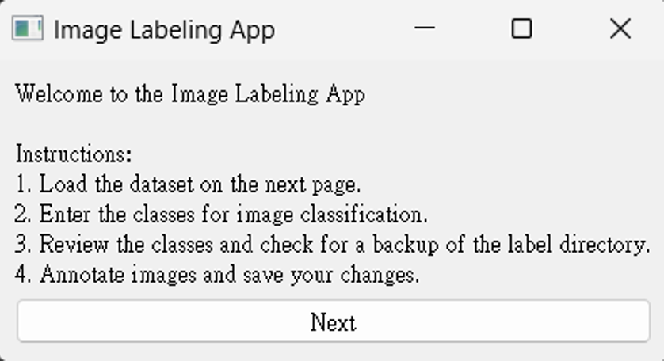
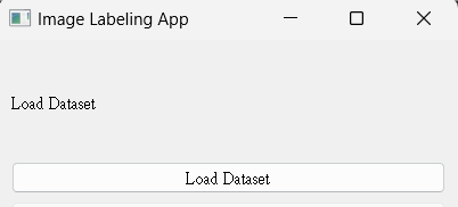
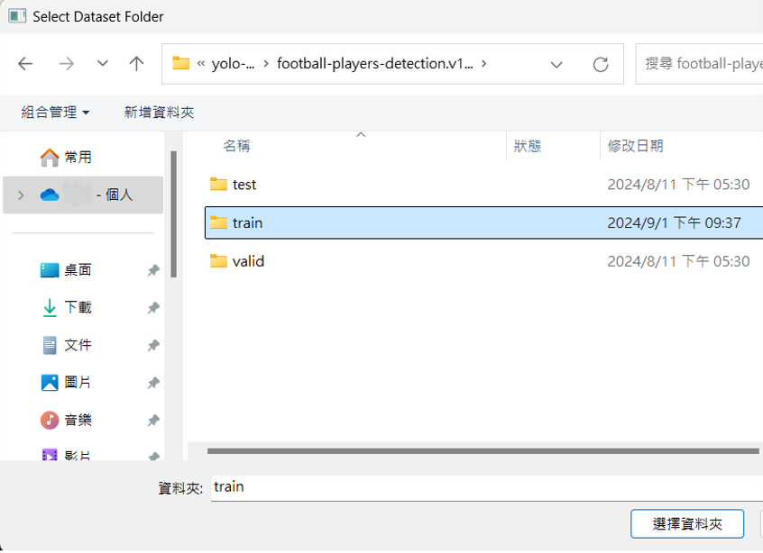
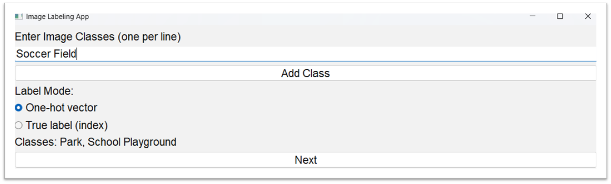
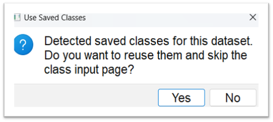
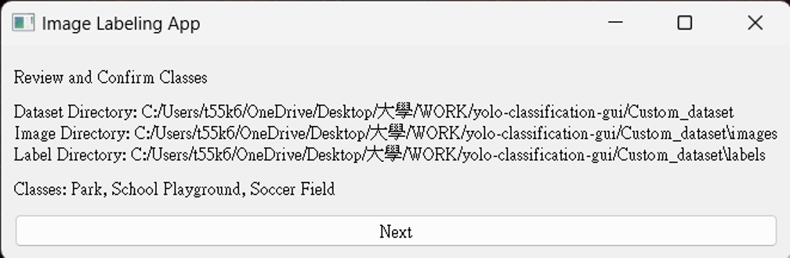
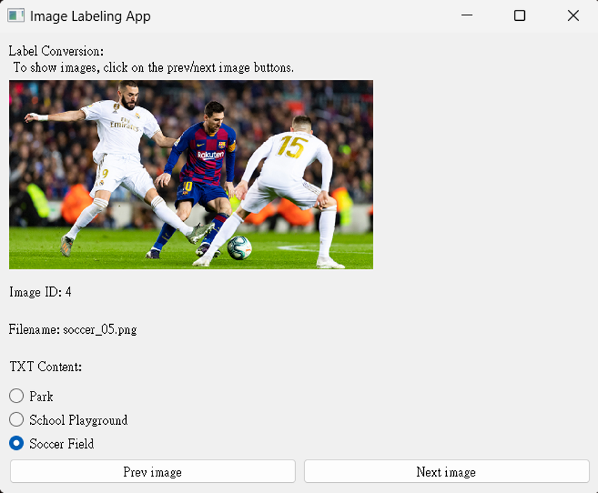
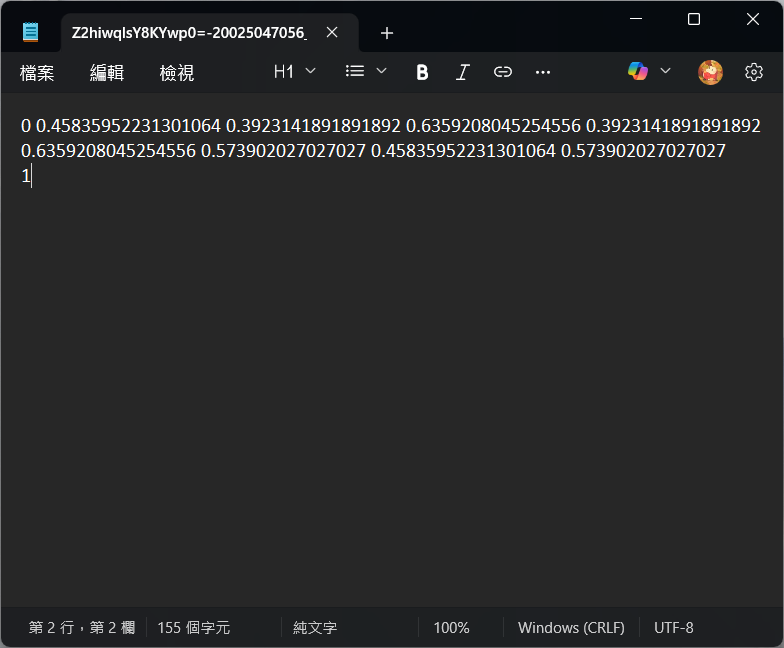

# yolo-classification-gui-by-gyf-v1使用教學
## 安裝說明
### 系統需求
作業系統
Windows 10 / 11
Python建議 ≥3.8

需要另外安裝的第三方套件：

PyQt5（提供 QApplication, QMainWindow, QWidget, QLabel, QPushButton, QFileDialog, QMessageBox 等）
numpy
安裝指令：
```bash
pip install PyQt5 numpy
```

執行方式：
```bash
python yolo-classification-gui-by-gyf-v1.py
```

## 流程簡介
閱畢後請點選“Next”進入下一步。
<p align="center">

</p>

## 📁 步驟 1: 載入資料集
點選“Load Dataset”挑選資料集。

<p align="center">

</p>

<p align="center">

</p>

> [!IMPORTANT]
> 資料集內部需含有資料夾 `images` 及 `labels`（`labels` 可用 `labelTxt` 替代）。

## ⚙️ 步驟 2: 設定類別格式
這邊可能跳出兩種畫面，分別是第一次使用這個程式與接續使用，您可以檢查 `labels` 或 `labelTxt` 內是否存在檔案 classes.txt 。

### CASE１:第一次使用將需要的類別分次輸入，如下圖。並根據需求選擇One-hot vector或是True label完成後點選“Next”
此處類別假設了踢足球的三種可能場景，公園、學校操場與足球場。

<p align="center">
  
</p>

> [!TIP]
> ### 💡 標籤格式輸出對比
> 根據您的模型需求，輸出結果將有以下差異：
> - **One-hot vector**：若選擇此項，第二個類別將標記為 `0 1 0 0`。
> - **True label (0-base)**：若選擇此項，第四個類別將標記為 `3`。

### CASE２:接續使用可以點選Yes跳過輸入類別。
<p align="center">

</p>

## ✅ 步驟 3: 路徑、類別確認
確認檔案正確後點選“Next”。
<p align="center">

</p>

## ✍️ 步驟 4: 開始標記
上述完成後即可開始使用，完成後點選“Ｘ”離開。
<p align="center">

</p>

> [!TIP]
> **提升效率的小技巧：**
> 不需要每次都用滑鼠點擊！您可以透過鍵盤進行盲打操作：
> - **數字鍵 `0-9`**：直接進行類別標記(上限為10種類別)。
> - **左右方向鍵 `←` `→`**：快速切換圖片。

## 成果
以下用 True Label 模式作為範例，若點選mile則會在.txt檔案的最後一行加上數字標記`1`，上方原有的資料不改動。

<p align="center">

</p>

<p align="center">

</p>
